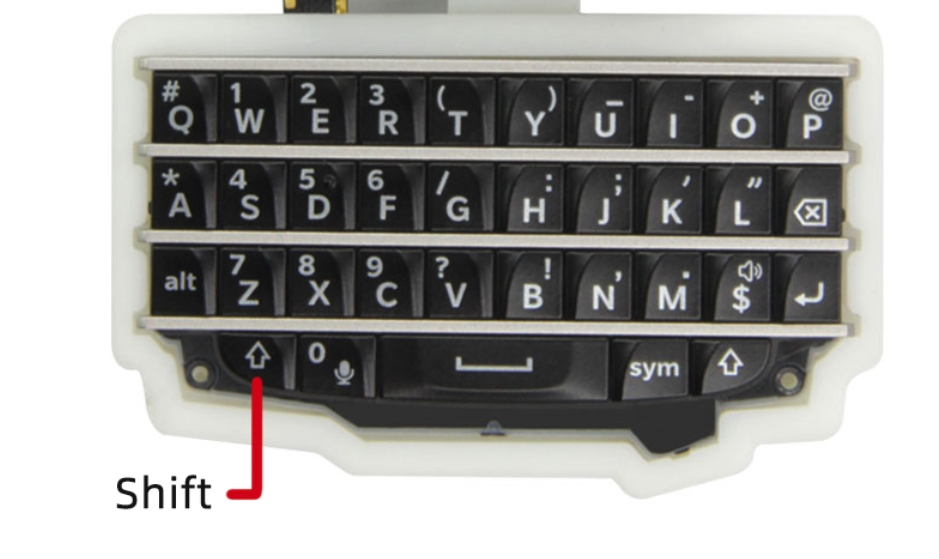

<h1 align = "center">🌟LilyGO T-WATCH-Keyboard🌟</h1>

### 中文 | [English](../README.md) 

<h2 align = "left">Use the tutorial ⚡:</h2>

1. **Help**: 显示可支持函数功能

2. **Scan**: 运行WiFi测试功能

3. **Connect Wi-Fi**: 连接Wi-Fi
     - [Wi-Fi account] 
     - [Wi-Fi password]

4. **Shift + C**: 清空文本屏幕

5. **Shift + B**: 开关屏幕背光

<h2 align = "left">Quick start ⚡:</h2>

1. **Download** dependency library
     - [TTGO_TWatch_Library](https://github.com/Xinyuan-LilyGO/TTGO_TWatch_Library)
     
2. **Import** dependency library

3. **Download** this github

4. **Upload** code

