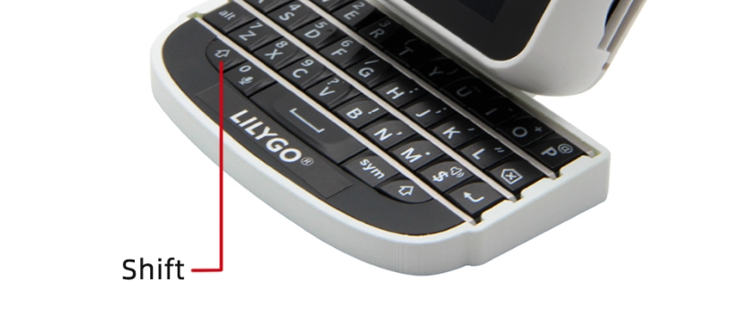

<h1 align = "center">🌟LilyGO T-WATCH-Keyboard🌟</h1>

### 中文 | [English](../README.md) 

<h2 align = "left">程序使用教程 ⚡:</h2>

1. **Help**: 显示可支持函数功能

2. **Scan**: 运行WiFi测试功能

3. **Connect Wi-Fi**: 连接Wi-Fi
     - [Wi-Fi account] 
     - [Wi-Fi password]

4. **Shift + C**: 清空文本屏幕

5. **Shift + B**: 开关屏幕背光

<h2 align = "left">源代码烧录 ⚡:</h2>

1. **下载** 依赖库
     - [TTGO_TWatch_Library](https://github.com/Xinyuan-LilyGO/TTGO_TWatch_Library)
     
2. **导入** 上述依赖库

3. **下载** 当前GitHub代码

4. **上传** 程序

